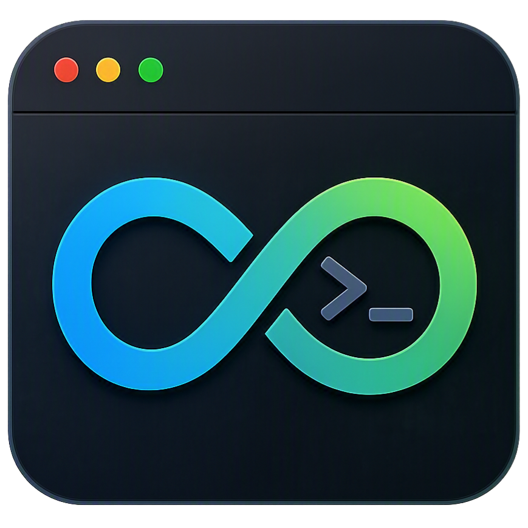

# EternalTerminal

<p align="center">
  
</p>

<h3 align="center">
A modern Qt6 terminal emulator built from scratch.
</h3>

<p align="center">
  Custom terminal experience for Linux with native performance and a modern interface.
</p>

---

## Features

* 🚀 Built with **C++ and Qt6**
* 🖥️ Native terminal rendering
* 🐚 PTY based shell integration
* 🎨 Custom modern UI
* 🖱️ Mouse selection and scrolling
* 📋 Copy / paste support
* 🔄 Dynamic terminal resizing
* ⌨️ Keyboard shortcuts
* 🪟 Custom window title bar
* 📦 Arch Linux package support

---

## Screenshots

<p align="center">
  
</p>

More screenshots can be found in the project releases.

---

## Installation

### Arch Linux / Arch-based distributions

Install from AUR:

```bash
yay -S eternal-terminal
```

Or using an AUR helper:

```bash
paru -S eternal-terminal
```

---

## Building from source

### Dependencies

Install required packages:

```bash
sudo pacman -S qt6-base qt6-declarative cmake git
```

Clone repository:

```bash
git clone https://github.com/FourSage747/EternalTerminal.git
cd EternalTerminal
```

Build:

```bash
cmake -B build -S .
cmake --build build
```

Run:

```bash
./build/EternalTerminalApp
```

---

## Project Status

EternalTerminal is currently in active development.

Planned improvements:

* Better terminal emulation compatibility
* More ANSI escape sequence support
* Configuration system
* Themes
* Tabs and multiple terminal sessions

---

## License

This project is licensed under the GPL License.

---

## Author

Created by **EternalEngineer**

GitHub:
https://github.com/FourSage747
